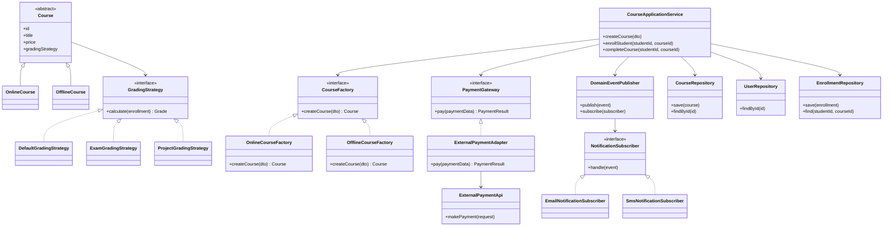

# Задание 1. Рефакторинг системы управления онлайн-курсами

## Краткий анализ исходной системы

В текущей реализации класс `CourseManager` выполняет слишком много задач:

- создает курсы разных типов;
- хранит данные о курсах и пользователях;
- рассчитывает итоговую оценку;
- отправляет уведомления;
- напрямую вызывает внешний платежный API;
- содержит повторяющуюся логику.

Основные проблемы:

1. Нарушение принципа единственной ответственности: один класс отвечает и за бизнес-логику, и за инфраструктуру.
2. Нарушение принципа открытости/закрытости: при добавлении нового типа курса нужно менять `CourseManager`.
3. Жесткая фиксация алгоритма оценки: нельзя заменить расчет без изменения основного класса.
4. Прямое встраивание уведомлений в бизнес-логику.
5. Прямая зависимость от внешнего платежного API.
6. Дублирование похожих действий в разных методах.
---
##  Новая структура системы

Вместо одного большого класса предлагается разделить систему на отдельные сервисы, интерфейсы и реализации.

Основные элементы:

- `CourseApplicationService` — управляет сценариями работы: создание курса, запись студента, завершение обучения.
- `Course` — базовая сущность курса.
- `OnlineCourse`, `OfflineCourse` — конкретные типы курсов.
- `CourseFactory` — создает курсы, скрывая конкретные классы.
- `GradingStrategy` — интерфейс алгоритма расчета оценки.
- `DefaultGradingStrategy`, `ExamGradingStrategy`, `ProjectGradingStrategy` — разные способы расчета оценки.
- `CourseRepository`, `UserRepository`, `EnrollmentRepository` — работа с хранилищем данных.
- `DomainEventPublisher` — публикует события системы.
- `NotificationSubscriber` — интерфейс подписчика на события.
- `EmailNotificationSubscriber`, `SmsNotificationSubscriber` — конкретные каналы уведомлений.
- `PaymentGateway` — внутренний интерфейс оплаты.
- `ExternalPaymentAdapter` — адаптер к конкретному внешнему платежному API.
---
##  Диаграмма классов

---
##  Используемые паттерны

| Паттерн        | Где используется                                               | Какую задачу решает                                                                                                                        |
|----------------|----------------------------------------------------------------|--------------------------------------------------------------------------------------------------------------------------------------------|
| Factory Method | `CourseFactory`, `OnlineCourseFactory`, `OfflineCourseFactory` | Убирает создание конкретных курсов из `CourseManager`. Новый тип курса добавляется через новую фабрику, а не через изменение старого кода. |
| Strategy       | `GradingStrategy` и его реализации                             | Позволяет менять алгоритм расчета оценки без изменения сервиса курсов.                                                                     |
| Observer       | `DomainEventPublisher` и подписчики уведомлений                | Уведомления становятся реакцией на событие, а не частью основной бизнес-логики.                                                            |
| Adapter        | `PaymentGateway` и `ExternalPaymentAdapter`                    | Изолирует систему от конкретного внешнего платежного API. При смене провайдера меняется адаптер, а не бизнес-логика.                       |
---
##  Соответствие проблем и решений

| Проблема                                              | Решение                                                                                            | Используемый паттерн       | Обоснование                                                                  |
|-------------------------------------------------------|----------------------------------------------------------------------------------------------------|----------------------------|------------------------------------------------------------------------------|
| В `CourseManager` сосредоточены разные обязанности    | Выделить `CourseApplicationService`, репозитории, фабрики, стратегии, платежный шлюз и уведомления | Разделение ответственности | Каждый класс отвечает только за свою часть системы.                          |
| Создание курсов через `if/else` и прямые конструкторы | Вынести создание курсов в фабрики                                                                  | Factory Method             | `CourseApplicationService` не знает, какой конкретный класс курса создается. |
| Алгоритм оценки жестко зафиксирован                   | Вынести расчет оценки в `GradingStrategy`                                                          | Strategy                   | Для разных курсов можно использовать разные стратегии оценки.                |
| Уведомления встроены в бизнес-логику                  | Публиковать события и обрабатывать их подписчиками                                                 | Observer                   | Добавление нового канала уведомлений не требует изменения основной логики.   |
| Прямая зависимость от внешнего платежного API         | Ввести `PaymentGateway` и адаптер внешнего API                                                     | Adapter                    | Внешний API скрыт за внутренним интерфейсом.                                 |
| Дублирование похожей логики                           | Общие операции вынести в сервисы и репозитории                                                     | DRY                        | Повторяющийся код заменяется переиспользуемыми компонентами.                 |
---
##  Краткий вывод

Новая архитектура делает систему проще для развития. `CourseApplicationService` управляет основными сценариями, 
но не занимается созданием объектов, расчетом оценок, отправкой уведомлений и деталями оплаты. 
За счет Factory Method, Strategy, Observer и Adapter система становится менее связанной, лучше соответствует DRY, KISS и принципу разделения ответственности.
