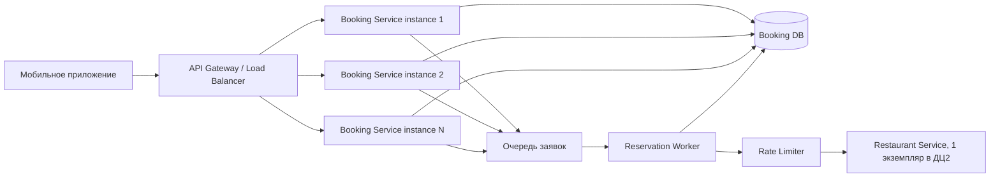

# Задание 2. Архитектура системы бронирования ресторанов

##  Краткое описание ситуации

Система состоит из двух микросервисов:

1. Сервис бронирований в ДЦ1.
2. Сервис ресторанов в ДЦ2.

При каждом бронировании сервис бронирований синхронно вызывает сервис ресторанов по REST. При обычной нагрузке система работает, но при пике до 50 000 запросов в секунду падают сначала экземпляры сервиса бронирований, а затем мог бы упасть единственный сервис ресторанов.

Важные ограничения:

- сервис ресторанов масштабировать нельзя;
- исходного кода сервиса ресторанов нет;
- сервис бронирований можно масштабировать;
- отказ пользователю в пиковую нагрузку запрещен;
- бронь может обрабатываться не моментально, но должна быть обработана в течение 24 часов;
- свободные столики считаются бесконечными.
---
##  Центральная проблема 1: неправильная балансировка нагрузки

Мобильное приложение знает адреса всех экземпляров сервиса бронирований и всегда начинает с первого IP. Поэтому при пиковой нагрузке весь поток сначала идет на первый экземпляр, потом на второй и так далее.

Это приводит к каскадному падению экземпляров сервиса бронирований.

### Решение

Нужно убрать балансировку из мобильного приложения и поставить перед сервисом бронирований общий входной слой:

- API Gateway или Load Balancer;
- единый публичный адрес для приложения;
- равномерное распределение запросов между экземплярами сервиса бронирований;
- автоматическое масштабирование сервиса бронирований в ДЦ1.

Мобильное приложение должно обращаться не к списку IP-адресов, а к одному стабильному адресу.

---
##  Центральная проблема 2: синхронная зависимость от единственного сервиса ресторанов

Сервис бронирований при каждом запросе синхронно вызывает сервис ресторанов. 

Из-за этого:
- таймаут сервиса ресторанов ломает пользовательский запрос;
- пиковая нагрузка напрямую передается на сервис ресторанов;
- единственный экземпляр сервиса ресторанов становится узким местом;
- сервисы в разных ДЦ сильнее зависят от сетевых задержек и ошибок.

### Решение

Нужно перейти к асинхронной обработке заявок через очередь.

Предлагаемая схема:

1. Пользователь отправляет заявку на бронирование.
2. Сервис бронирований быстро сохраняет заявку со статусом `CREATED`.
3. Заявка помещается в надежную очередь.
4. Пользователь сразу получает ответ: заявка принята в обработку.
5. Отдельные воркеры постепенно читают очередь и обращаются к сервису ресторанов.
6. Воркеры ограничивают скорость запросов к сервису ресторанов, чтобы не перегружать его.
7. После обработки статус бронирования меняется на `CONFIRMED`.

Так как столики бесконечные, нет необходимости отказывать пользователям на пике. 
Заявки можно накопить и обработать равномерно в течение 24 часов.

---
##  Схема балансировки

---
##  Сводная таблица

| Проблема                                                                 | Суть проблемы                                                                           | Решение                                                                                  |
|--------------------------------------------------------------------------|-----------------------------------------------------------------------------------------|------------------------------------------------------------------------------------------|
| Мобильное приложение само выбирает IP и всегда начинает с первого адреса | Нагрузка распределяется неравномерно, экземпляры сервиса бронирований падают по очереди | Ввести API Gateway / Load Balancer и единый адрес для приложения                         |
| Сервис бронирований синхронно вызывает единственный сервис ресторанов    | Пиковая нагрузка и ошибки сервиса ресторанов напрямую ломают пользовательские запросы   | Перейти к асинхронной обработке через очередь и воркеры                                  |
| Сервис ресторанов нельзя масштабировать                                  | Он не выдержит 50 000 запросов в секунду                                                | Ограничить скорость запросов к нему через rate limiter и обрабатывать очередь постепенно |
| Пользователям нельзя отказывать в пиковую нагрузку                       | Нельзя просто поставить жесткий лимит и возвращать ошибку                               | Быстро принимать заявки, сохранять их и обрабатывать позже                               |
| Вызовы идут между разными ДЦ                                             | Сетевые задержки и таймауты влияют на пользовательский запрос                           | Убрать меж-ДЦ вызов из синхронного пользовательского сценария                            |
---
##  Краткий вывод

Главные изменения: убрать клиентскую балансировку и разорвать синхронную связь с сервисом ресторанов.
Сервис бронирований должен быстро принимать заявки,
а обращение к сервису ресторанов должно выполняться асинхронно и с контролируемой скоростью. 
Это позволяет выдерживать пики, не масштабируя сервис ресторанов и не отказывая пользователям.
