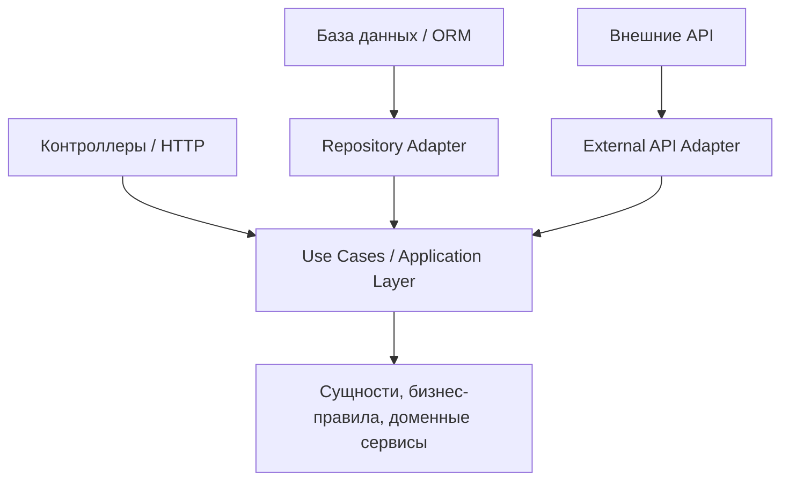

# Задание 3. Бизнес-логика и инфраструктурные зависимости

## Ошибки текущий архитектуры

Основные проблемы:

1. Сильная связанность бизнес-логики и инфраструктуры.
2. Сложность тестирования бизнес-правил без базы данных, HTTP и ORM.
3. Нарушение разделения ответственности.
4. Высокая стоимость изменений.
5. Риск сломать бизнес-правила при изменении технических деталей.

Это плохая архитектура, потому что бизнес-логика становится зависимой от инфраструктуры. 
Например, изменение схемы базы данных или внешнего API вынуждает менять не только технический код,
но и правила расчета скидок, проверки льгот и обработки заявок.

---
##  Подход, который здесь уместен

Для такой системы уместен подход Clean Architecture.

Главная идея: бизнес-логика должна находиться в центре системы и не зависеть от технических деталей.

Зависимости должны быть направлены внутрь:

---
##  Как подход решает проблему

Бизнес-правила выносятся в отдельный доменный слой:

- расчет скидки;
- проверка права на льготы;
- правила обработки заявок.

Контроллеры должны только принимать HTTP-запрос, преобразовывать его в команду или DTO и вызывать нужный сценарий.

ORM и SQL должны быть спрятаны за интерфейсами репозиториев.
Внешние API должны быть спрятаны за интерфейсами портов.

Пример разделения:

| Слой                 | Ответственность                                                            |
|----------------------|----------------------------------------------------------------------------|
| Domain Layer         | Бизнес-правила: скидки, льготы, ограничения, сущности                      |
| Application Layer    | Сценарии использования: подать заявку, рассчитать скидку, проверить льготу |
| Infrastructure Layer | ORM, SQL, база данных, внешние API                                         |
| Presentation Layer   | HTTP-контроллеры, обработка входящих запросов                              |
---
##  Ключевые изменения

| Было                                                          | Станет                                                 |
|---------------------------------------------------------------|--------------------------------------------------------|
| Бизнес-логика находится в контроллерах и технических сервисах | Бизнес-логика находится в доменном слое                |
| Изменение базы данных ломает бизнес-правила                   | База данных заменяется через адаптер или репозиторий   |
| Сложно тестировать без HTTP и БД                              | Бизнес-правила можно тестировать обычными unit-тестами |
| Контроллеры содержат много логики                             | Контроллеры только передают запрос в use case          |
| Внешние API напрямую используются в логике                    | Внешние API скрыты за портами и адаптерами             |
---
##  Краткий вывод

Проблема системы в том, что бизнес-логика зависит от инфраструктурных деталей.
Подход Clean Architecture решает это за счет разделения слоев и направления зависимостей внутрь.
В результате бизнес-правила становятся независимыми от HTTP, ORM, SQL и внешних API, а систему проще тестировать и развивать.
